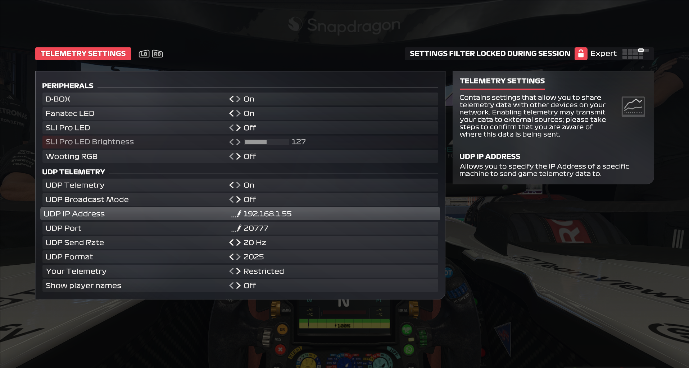
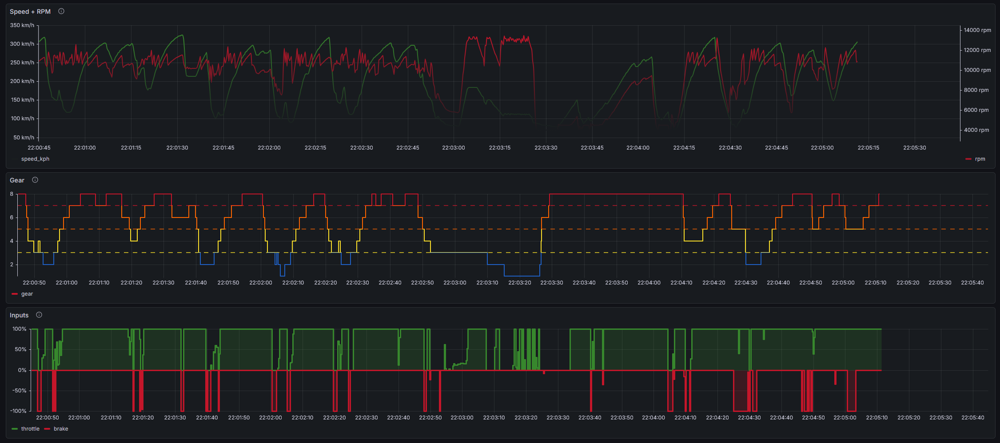
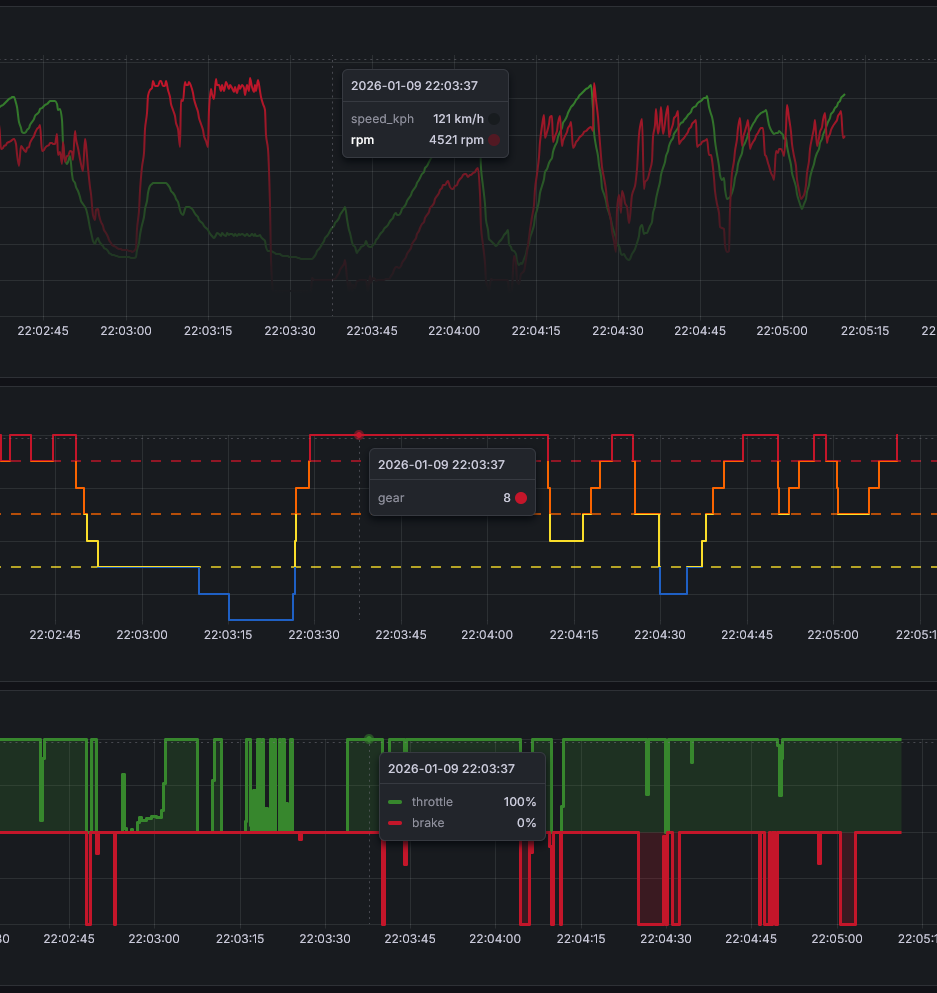
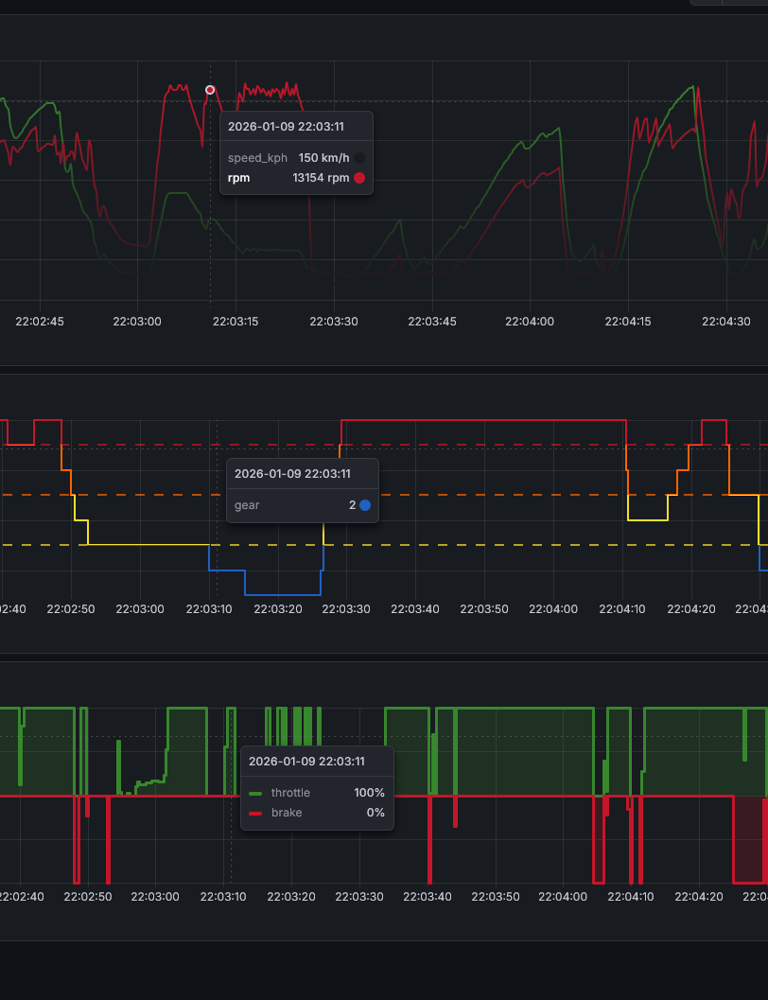
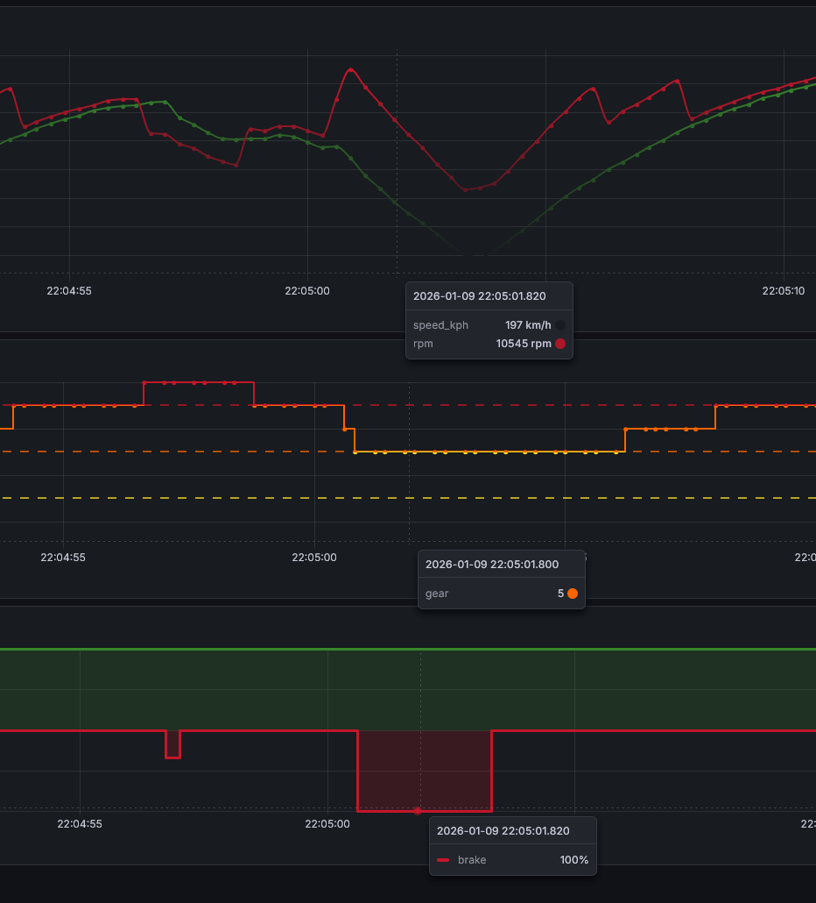
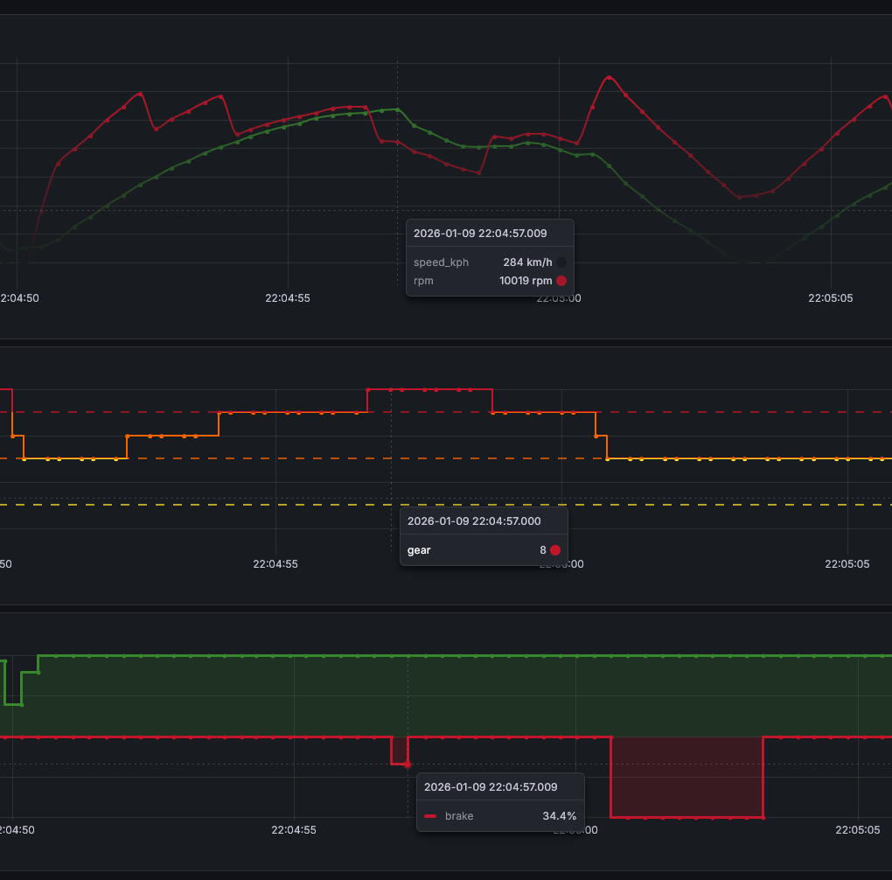

# Telemetry Scan

Telemetry Scan is an appliance compatible with EA Sports F1 2025 that collects and stores the game's telemetry data, allowing you to analyze and visualize it with graphs.

Telemetry Scan runs in an Ubuntu 22.04.5 LTS (Jammy Jellyfish) Vagrant VM (ubuntu/jammy64). The stack uses TimescaleDB as the time-series database to persist telemetry data, Grafana for visualization, and a Python-based parser to decode the F1 2025 telemetry UDP stream. The parser is packaged as a Docker image. All components run as a Kubernetes workload on a single-node k3s cluster inside the VM.

## Installation

Telemetry Scan is designed to run with [Vagrant](https://developer.hashicorp.com/vagrant/install) and [VirtualBox](https://www.virtualbox.org/wiki/Downloads) by default. You can switch to another provider by updating the `Vagrantfile`, or reuse specific components in your own environment. By default, it allocates 8 GiB of RAM and 4 vCPUs.

Go to project root directory and run the command below:

`vagrant up`

After the bootstrap process, you should see output like this:

```
    default: [BOOTSTRAP] Deploying Telemetry Gateway...
    default: [BOOTSTRAP] Done!
    default: [BOOTSTRAP] Waiting Telemetry Gateway rollout...
    default: [BOOTSTRAP] Done!
```

You'll need your new VM's IP address to configure the game and to access to Grafana. You can use `vagrant ssh` to connect to your VM and find the IP address yourself. You can also use the command below in Windows PowerShell (IP address can be seen as 192.168.1.55 in this example):

```
PS D:\Projeler\Telemetry-Scan> vagrant ssh -c "ip -4 route show default | tr -s ' '"
default via 10.0.2.2 dev enp0s3 proto dhcp src 10.0.2.15 metric 100
default via 192.168.1.1 dev enp0s8 proto dhcp src 192.168.1.55 metric 100
```

To shut down the appliance, simply run `vagrant halt` (add `--force` to force shut down). To completely remove the appliance, you can use `vagrant destroy`.

## Collected Data

Telemetry Scan collects the data listed below. You can visualize this data however you like. Feel free to try out some combinations to enhance your racing experience.

- Speed
- RPM
- Gear
- Throttle and Brake
- Tyre Temperatures
- Brake Temperatures
- Engine Temperature

## Access

Once you get your IP address, you can access Grafana in a web browser. The default port is `32000`:

`http://<IP-ADDRESS>:32000`

The default Grafana credentials are: `Username: admin & Password: telemetryscan`

Make sure you enter your VM's IP address in the F1 2025 telemetry settings. Leave the port default (`20777`).

Let's race!



*F1 2025 Telemetry Settings*

## Usage

Once the appliance is up and running, it starts listening for telemetry data. F1 2025 sends UDP packets about your session. Decoding these packets usually results something similar to this:

```
GW] #2866 bytes=1352 from=192.168.1.200:58193 format=2025 year=25 pid=6 pver=1 sessionTime=223.067 frame=4480 overallFrame=4480 t=2026-01-08T01:56:35+00:00
[TEL] t=223.067s frame=  4480 speed=215kph thr=1.00 brk=0.00 str=-0.00 gear= 8 rpm=7683 drs=0 eng=110C psi=[22.0,22.0,24.9,24.9]
[GW] #2867 bytes=1239 from=192.168.1.200:58193 format=2025 year=25 pid=7 pver=1 sessionTime=223.067 frame=4480 overallFrame=4480 t=2026-01-08T01:56:35+00:00
[GW] #2868 bytes=1041 from=192.168.1.200:58193 format=2025 year=25 pid=10 pver=1 sessionTime=223.119 frame=4481 overallFrame=4481 t=2026-01-08T01:56:35+00:00
[GW] #2869 bytes=1460 from=192.168.1.200:58193 format=2025 year=25 pid=11 pver=1 sessionTime=223.119 frame=4481 overallFrame=4481 t=2026-01-08T01:56:35+00:00
[GW] #2870 bytes=231 from=192.168.1.200:58193 format=2025 year=25 pid=12 pver=1 sessionTime=223.119 frame=4481 overallFrame=4481 t=2026-01-08T01:56:35+00:00
[GW] #2871 bytes=1285 from=192.168.1.200:58193 format=2025 year=25 pid=2 pver=1 sessionTime=223.119 frame=4481 overallFrame=4481 t=2026-01-08T01:56:35+00:00
[GW] #2872 bytes=1349 from=192.168.1.200:58193 format=2025 year=25 pid=0 pver=1 sessionTime=223.119 frame=4481 overallFrame=4481 t=2026-01-08T01:56:35+00:00
[GW] #2873 bytes=273 from=192.168.1.200:58193 format=2025 year=25 pid=13 pver=1 sessionTime=223.119 frame=4481 overallFrame=4481 t=2026-01-08T01:56:35+00:00
[GW] #2874 bytes=1352 from=192.168.1.200:58193 format=2025 year=25 pid=6 pver=1 sessionTime=223.119 frame=4481 overallFrame=4481 t=2026-01-08T01:56:35+00:00
[TEL] t=223.119s frame=  4481 speed=216kph thr=1.00 brk=0.00 str=-0.00 gear= 8 rpm=7713 drs=0 eng=110C psi=[22.0,22.0,24.9,24.9]
[GW] #2875 bytes=1239 from=192.168.1.200:58193 format=2025 year=25 pid=7 pver=1 sessionTime=223.119 frame=4481 overallFrame=4481 t=2026-01-08T01:56:35+00:00
```

Telemetry Scan's `telemetry-gateway.py` script parses this data and writes it to TimescaleDB. Later on, you can open Grafana in your web browser, then go to `Dashboards > Core View` to see your graphs.

Note: Telemetry Scan sets TimescaleDB as Grafana's data source during initialization and adds the `Core View` dashboard. You can customize this dashboard or create additional dashboards as needed.

## Screenshots



*Grafana Core View Dashboard*



*Early upshift. Full throttle at low RPM and low speed.*



*Over-revving. Held the gear too long. High RPM at low speed.*



*Potential brake lock. 100% throttle + 100% brake overlap.*



*Throttle–brake overlap. Potential brake heating, tyre wear, and loss of pace.*

## Under the Hood

I'm still learning most of the components in this stack. I built it for personal use and decided to release it under the GPLv3. Security wasn't a concern for this project. All credentials are stored in plain text, which is obviously not best practice. Use it with caution.

### Credentials

Grafana user: admin
Grafana password: telemetryscan
TimescaleDB name: f1
TimescaleDB user: f1
TimescaleDB password: f1pass

### bootstrap.sh

`bootstrap.sh` performs the following steps, in order:

- Updates packages and installs required packages.
- Installs k3s. Configures it for the `vagrant` user. Creates the `f1` namespace.`
- Installs Helm, then installs TimescaleDB and Grafana via Helm charts.
- Imports the default Grafana dashboard (`Core View`).`
- Deploys Telemetry Gateway.

`bootstrap.sh` cannot run without the files in the `bootstrap-files` directory. These files are used for initializing the TimescaleDB by creating the default table, configuring Grafana's data source, importing the default Grafana dashboard, and deploying the Telemetry Gateway container image.

### Telemetry Gateway

Telemetry Gateway handles the UDP telemetry stream from the game, decodes and parses the packets, and then writes the data to TimescaleDB.

The Python script can be found under the `src` directory if you'd like to take a look. The container image is available on [Docker Hub](https://hub.docker.com/r/alisezisli/telemetry-gateway).